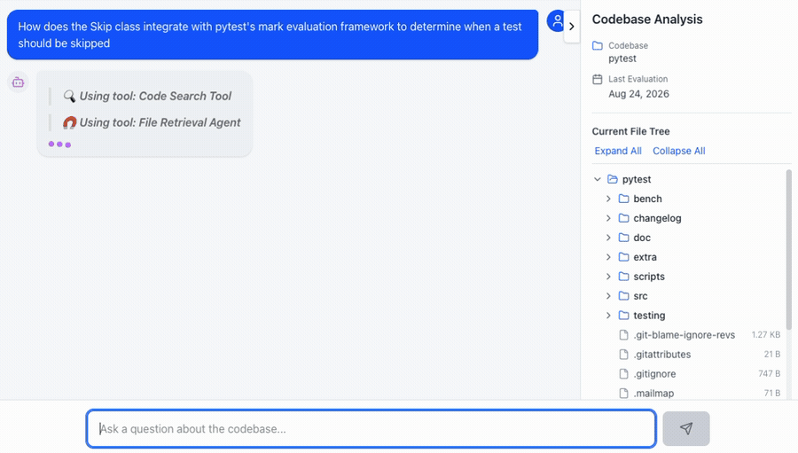
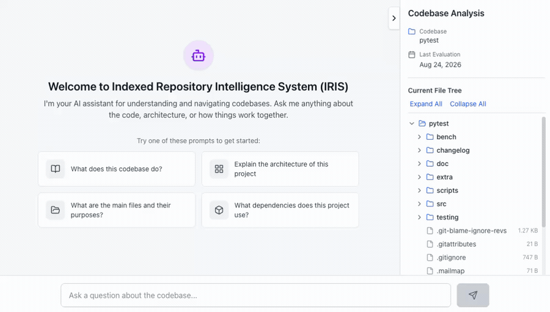

<!-- Copyright Amazon.com, Inc. or its affiliates. All Rights Reserved. -->
<!-- SPDX-License-Identifier: MIT-0 -->

# Indexed Repository Intelligence System (IRIS)

Ask questions about any repository and get detailed, grounded answers. IRIS reads a repository once and summarizes every file, then uses that summary index to load all the relevant files at once for each question, so answers cite real code instead of guessing.

Built on AWS-native primitives (Amazon Bedrock, Strands Agents, AgentCore), IRIS offers four ways in: a CLI, a deployable web app, an agent skill, and an MCP server. Use it for onboarding and knowledge transfer, to augment your coding assistant, or as a template for embedding codebase understanding into your own applications.



You don't need to know what to ask, either. IRIS opens with suggested prompts, and clicking any file in the tree prefills the question box with `Tell me about <path>`.



## Why IRIS

- **Answers for everyone.** The deployable web app lets product managers, security reviewers, and new hires ask codebase questions from a browser. No terminal, no local setup, no AWS credentials.
- **Benchmarked against the leading alternative.** On [SWE-QA](https://github.com/peng-weihan/SWE-QA-Bench), an open-source benchmark for repository-level code question answering, IRIS outperforms DeepWiki on 14 of 15 repositories using Claude Sonnet and 13 of 15 using Haiku.
- **Code *and* project documents.** IRIS indexes slide decks, design docs, spreadsheets, PDFs, and recorded meetings alongside source code, so you can ask "is there code in the repo matching what we discussed at kickoff?" and get an answer grounded in both. See [Project Artifact Indexing and QA](docs/artifact-indexing.md).
- **Works inside your coding assistant.** The `iris-query` skill and MCP server bring IRIS into coding assistants such as Claude Code, Kiro, and Cline, where a precomputed summary replaces 10–20 exploratory tool calls per question.
- **No vector database.** The summary index is readable JSON. Commit it next to your code along with the `iris-query` skill, and teammates get full codebase context from a plain `git clone`.
- **Grounded, not stale.** Local hashing detects file drift on every question, so changed files are read live rather than answered from an outdated summary.
- **Answers in a single pass.** One call ranks every file relevant to the question, then all of them are ingested in one bulk read. No file-by-file exploration loop, so answers come back faster.

## Quick Start

### Fastest Path: Interactive Deployment Script

The fastest way to get started is using the interactive deployment script:

```bash
# From the repository root
./deploy.sh
```

This script installs Python virtual environment and provides 5 UI-based deployment options, all of which install the needed resources and walk you through setting up the codebase to be evaluated.

| Option                             | Use Case                  | Complexity | Requirements                 | UI Access               |
| ---------------------------------- | ------------------------- | ---------- | ---------------------------- | ----------------------- |
| **Local (No Docker)**              | Development, Testing      | Low        | Python, Node.js, AWS CLI.    | http://localhost:3000   |
| **Local Docker (Local Artifacts)** | Integration Testing       | Medium     | Docker, Docker Compose       | http://localhost:3000   |
| **Local Docker (S3 Artifacts)**    | Cloud Integration Testing | Medium     | Docker, S3 Bucket            | http://localhost:3000   |
| **Cloud Deployment**               | Production                | High       | AWS Account, CDK, S3, Docker | CloudFront URL          |
| **Agent Skill Installation**       | AI Assistant Integration  | Low        | Python, AWS CLI (indexer only) | Via Claude Code/Kiro/Cline |
| **MCP Server Deployment**          | AI Assistant Integration  | Low        | Python, AWS CLI              | Via Cline/Kiro          |

Note: Options 2 and 3 (Local Docker deployments) are primarily intended for developers for testing purposes. End-users should choose other deployment options based on their use cases.

### Quick Examples

**Local Testing (No Docker):**

```bash
./deploy.sh
# Select option 1, follow prompts
# Access at http://localhost:3000/
```

**Cloud Deployment:**

```bash
./deploy.sh
# Select option 4, follow the deployment wizard
# Get CloudFront URL at the end
```

**Agent Skill:**

```bash
./deploy.sh
# Select option 5, follow prompts
# Open a new session in your coding assistant and start using the `iris-query` skill
```

### CLI Usage

**Prerequisites:** Before using these CLI commands, you must first:

- Run `./deploy.sh` to create Python virtual environment and setup codebase
- Manually activate the virtual environment:

```bash
# Activate on macOS/Linux
source .venv/bin/activate

# Activate on Windows
.venv\Scripts\activate
```

**Available CLI commands:**

```bash
# Interactive chat with the codebase
iris chat

# Launch local React web interface
iris ui

# Launch legacy Streamlit interface (will be sunset in future versions)
iris streamlit

# Generate/update codebase + artifact context (preparation step)
iris prepare

# Generate/update codebase context only
iris prepare --code

# Generate/update project artifact context only
iris prepare --artifact
```

## Capabilities

- **Project artifact indexing and QA** — PPTX, DOCX, XLSX, PDF, MD, TXT, and video (`.mp4`, `.mov`, `.avi`, `.mkv`)
- **Multi-turn conversations** with streaming responses
- **Additional context support** — supplement the index with an external context file
- **Optional web search** — augment answers with web search results (`web_search`)
- **MCP integration in both directions** — expose IRIS to AI assistants, and let IRIS consume external MCP servers
- **Bulk multi-file ingestion** — relevant files are identified in one ranked pass and read as a single batch, capped by a configurable character budget
- **Exact-match code search** — regex search across the repo returning file paths, line numbers, and surrounding context, for the precise lookups a prose summary cannot answer
- **Performance** — prompt caching, parallel file processing across models and regions, and incremental re-indexing of changed files only

## Additional Documentation

This documentation is organized into several key areas to help you understand, deploy, and develop with IRIS:

### 🧠 [Agent Skill: `iris-query`](skills/iris-query/SKILL.md)

**More efficient codebase exploration with Claude Code, Kiro, and Cline**

**Start here if you're:** using Claude Code, Kiro, or Cline to understand or edit codebases but wanting to use a precomputed codebase summary to provide baseline context and accelerate the exploration.

Install it with `./deploy.sh` → option 5. The skill reads the precomputed index
(`.iris_cache/`) directly as data, so a coding assistant finds the right files in
a single lookup, then reads those files to ground the answer.

- **Zero-install for consumers.** Commit `.iris_cache/` and the skill folder — that is everything a teammate needs.
- **Staleness-safe.** Hashes are re-checked per question, so an out-of-date cache degrades to reading files live rather than to a wrong answer.
- **One artifact, three hosts.** The same folder works in Claude Code, Kiro, and Cline.
- **Complementary to the MCP server**, not a replacement — reading the index directly avoids a second LLM and needs no credentials at question time. Both integrations can be installed at once.

See [`skills/iris-query/references/details.md`](skills/iris-query/references/details.md) for the index schema, troubleshooting, and how to keep a committed cache fresh via pre-commit or CI.

### 📋 [Development Guide](docs/dev-guide.md)

**Essential for developers working on IRIS**

**Start here if you're:** Setting up a development environment, contributing code, or need to understand the development workflow.

Comprehensive guide covering:

- Development environment setup
- Project structure and organization
- Development workflows (local, Docker, MCP)
- Testing procedures and code quality
- Debugging techniques and troubleshooting
- Contributing guidelines and best practices

### 🚀 [Deployment Guide](docs/deployment-guide.md)

**Complete deployment instructions for all environments**

**Start here if you're:** Deploying IRIS locally or to the cloud, setting up production environments, or managing deployments.

Detailed deployment options:

- Interactive deployment script usage
- Local development deployment (with/without Docker)
- Docker deployment (local and S3 artifacts)
- Cloud deployment on AWS (manual and automated)
- Configuration management and security considerations
- Monitoring, maintenance, and troubleshooting

### 🤖 [Agentic Architecture](docs/agentic-architecture.md)

**Deep dive into the AI agent system**

**Start here if you're:** Understanding how the AI agents work, extending agent capabilities, or optimizing agent performance.

Comprehensive coverage of:

- Core agentic components and their interactions
- Specialized agents (file retrieval, code search)
- Strands framework integration
- Conversation management and memory handling
- Tool-based architecture and capabilities
- Performance optimizations and monitoring

### 🔌 [MCP Integration](docs/mcp.md)

**Model Context Protocol integration guide**

**Start here if you're:** Integrating IRIS with AI assistants, setting up MCP clients, or developing custom integrations.

Complete MCP integration coverage:

- MCP server implementation details
- Client integrations (Cline, Kiro)
- Configuration and setup procedures
- Usage examples and advanced features
- Troubleshooting and development guidance
- Custom client integration

For the reverse direction — configuring IRIS to **consume** external MCP servers (AWS Documentation, Bedrock AgentCore, Strands) — see [Consuming External MCP Servers](docs/mcp-integration.md).

### 📂 [Project Artifact Indexing and QA](docs/artifact-indexing.md)

**Indexing and querying project artifacts alongside code**

**Start here if you're:** Setting up artifact indexing for project documents, presentations, and reports, or understanding how the artifact QA pipeline works.

Comprehensive artifact feature coverage:

- Supported file formats and folder structure
- Indexing pipeline (discovery, extraction, summarization)
- Artifact selection and retrieval
- CLI, API, and MCP usage
- Configuration options and tuning
- Architecture and error handling

### 👥 [User Management](docs/user-management.md)

**Comprehensive user account management guide**

**Start here if you're:** Creating user accounts, managing existing users, or troubleshooting authentication issues.

Complete user management coverage:

- Cognito User Pool access and navigation
- Email-based user creation (email as username)
- Username-based user creation (custom username)
- Password policy requirements and examples
- User management operations (reset, disable, delete)
- Troubleshooting common authentication issues

### 🏗️ [System Architecture](docs/architecture.md)

**High-level system architecture and AWS services**

**Start here if you're:** Understanding the overall system design, planning infrastructure, or making architectural decisions.

Comprehensive architectural overview:

- System components and AWS services used
- Deployment architecture and patterns
- Security architecture and controls
- Data flow and processing pipelines

## Prerequisites

Before using IRIS, ensure you have:

### For Development

- Python 3.10+
- AWS CLI configured with Amazon Bedrock access
- Docker and Docker Compose (for containerized development)
- Node.js and npm (for frontend development)

### For Deployment

- AWS Account with appropriate permissions
- AWS CDK CLI installed
- Amazon S3 bucket for artifact storage
- Domain configuration (optional for custom domains)

### For MCP Integration

- Compatible AI assistant (Cline, Kiro)
- MCP client configuration access
- Virtual environment with IRIS installed

## Important: AI Services Opt-Out Policy

IRIS uses Amazon Bedrock to process your code artifacts. **Amazon Bedrock may use customer content for service improvements unless you opt out.**

### How to Opt Out

To prevent Amazon Bedrock from using your content for service improvements:

1. Enable the AI Services Opt-Out policy in your AWS Organizations account
2. Follow the instructions at: https://docs.aws.amazon.com/organizations/latest/userguide/orgs_manage_policies_ai-opt-out.html

### Key Points

- IRIS uses **your AWS account credentials** to call Amazon Bedrock directly
- Your content is processed using **your IAM roles and permissions**
- Amazon Bedrock automatically honors your AI Opt-Out policy when enabled
- **This is your responsibility** as the AWS account owner

For more information, see [AWS Service Terms](https://aws.amazon.com/service-terms/) Section 50.3.

## Important: Third-Party Services

When the optional web search feature is enabled (`web_search: true` in your
configuration), IRIS queries **DuckDuckGo** to retrieve search
results. DuckDuckGo is a third-party service, not an AWS service.

DuckDuckGo publishes its terms of service at https://duckduckgo.com/terms.
DuckDuckGo search is offered free of charge and has no published pricing.
You should review these terms and confirm that your use case complies with
them before enabling web search. To disable this feature, set `web_search: false`
in your configuration.

## Support and Resources

### Getting Help

- **Documentation Issues**: Check the specific guide for your use case
- **Development Questions**: Refer to [Development Guide](docs/dev-guide.md)
- **Deployment Problems**: See [Deployment Guide](docs/deployment-guide.md) troubleshooting section
- **Integration Issues**: Check [MCP Integration](docs/mcp.md) troubleshooting

### External Resources

- [Amazon Bedrock Documentation](https://docs.aws.amazon.com/bedrock/)
- [AWS CDK Documentation](https://docs.aws.amazon.com/cdk/)
- [Model Context Protocol](https://modelcontextprotocol.io/)
- [Strands Framework](https://strandsagents.com/latest/)

---

**Next Steps:**

1. Choose the appropriate guide based on your needs
2. Follow the setup instructions in the selected guide
3. Refer back to this index for cross-references and additional information
4. Use the troubleshooting sections when encountering issues

## Security

⚠️ **Important:** This asset is a proof-of-value demonstration and is not a production-ready solution. It passes automated security scanning at the time of contribution but is not guaranteed to receive ongoing security patches or dependency updates. You must thoroughly review all code before deploying to production. See [Security Documentation](docs/security.md) for details.

IRIS follows the [AWS Shared Responsibility Model](https://aws.amazon.com/compliance/shared-responsibility-model/). AWS is responsible for security _of_ the cloud, while customers are responsible for security _in_ the cloud, including:

- Configuring AWS services securely according to your requirements
- Managing access controls and authentication
- Encrypting sensitive data at rest and in transit
- Keeping dependencies up to date and patching known vulnerabilities
- Performing security reviews, penetration testing, and vulnerability assessments
- Ensuring compliance with your organization's security requirements

AWS offers a broad set of security tools and configurations to help you secure your workloads.

### Reporting a Vulnerability

If you discover a potential security issue in this project, we ask that you notify AWS/Amazon Security via our [vulnerability reporting page](https://aws.amazon.com/security/vulnerability-reporting/). Please do not create a public GitHub issue.

## License

This project is licensed under the MIT-0 License. See the [LICENSE](LICENSE) file.
