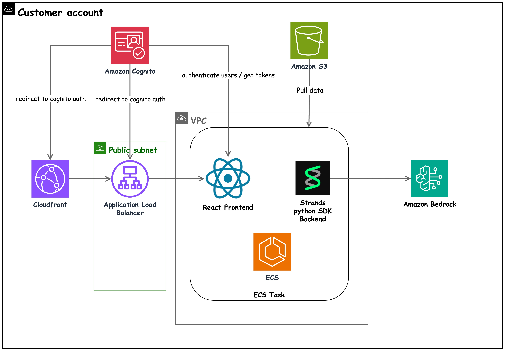

<!-- Copyright Amazon.com, Inc. or its affiliates. All Rights Reserved. -->
<!-- SPDX-License-Identifier: MIT-0 -->

# System Architecture

This document provides a comprehensive overview of the IRIS system architecture, including AWS services, deployment patterns, security considerations, and scalability features.

## Table of Contents

- [Architecture Overview](#architecture-overview)
- [System Components](#system-components)
- [AWS Services](#aws-services)
- [Security Architecture](#security-architecture)
- [Data Flow](#data-flow)

## Architecture Overview

IRIS is built as a cloud-native application leveraging AWS services for scalability, security, and reliability. The system follows a microservices architecture with clear separation of concerns between frontend, backend, and AI processing components.

### High-Level Architecture



### Key Architectural Principles

1. **Microservices Architecture**: Loosely coupled services with well-defined interfaces
2. **Cloud-Native Design**: Built for AWS with managed services
3. **Security by Design**: Multiple layers of security controls and encryption
4. **Event-Driven Processing**: Asynchronous processing for better performance
5. **Infrastructure as Code**: All infrastructure defined and managed through CDK
6. **Observability First**: Comprehensive logging, monitoring, and tracing

## System Components

### Frontend Layer

#### React Application

- **Technology**: React 18+ with TypeScript
- **Hosting**: CloudFront CDN with S3 origin
- **Features**:
  - Real-time WebSocket communication
  - Responsive design for multiple devices
  - Progressive Web App (PWA) capabilities
  - Client-side routing and state management

#### Configuration Management

- **Runtime Configuration**: Dynamic configuration loading
- **Environment-Specific Settings**: Development, staging, and production configs
- **Feature Flags**: Conditional feature enablement

### Backend Layer

#### WebSocket Server

- **Technology**: FastAPI with WebSocket support
- **Hosting**: AWS Fargate containers
- **Features**:
  - Real-time bidirectional communication
  - Session management and user isolation
  - Streaming response handling
  - Graceful connection handling

#### Session Management

- **Implementation**: In-memory hashmap with Redis backup (optional)
- **Features**:
  - Unique session isolation
  - Automatic cleanup on disconnect
  - Session persistence across container restarts
  - Multi-user concurrent support

### AI Processing Layer

#### Agentic Framework

- **Technology**: Strands framework with Amazon Bedrock integration
- **Components**:
  - Main orchestrating agent
  - Specialized sub-agents (file retrieval, code search)
  - Tool-based architecture
  - Conversation management

#### Model Integration

- **Primary Models**: Claude 4.5 Haiku and Sonnet via Amazon Bedrock
- **Features**:
  - Multi-model support for different tasks
  - Regional distribution for performance
  - Prompt caching for efficiency
  - Streaming response generation

### Data Layer

#### Codebase Storage

- **Primary**: S3 for artifact storage
- **Processing**: Local file system during analysis
- **Caching**: In-memory caching for frequently accessed data

#### Configuration Storage

- **Application Config**: YAML files in version control
- **Runtime Config**: Environment variables and parameter store
- **User Data**: Cognito for user profiles and preferences

## AWS Services

### Compute Services

#### AWS Fargate

- **Purpose**: Container orchestration for backend services
- **Configuration**:
  - CPU: 1024-4096 units (1-4 vCPUs)
  - Memory: 2048-8192 MB
  - Health checks and automatic recovery

#### AWS Lambda

- **Purpose**: Cognito pre-signup validation (only when self-signup is enabled)
- **Note**: Self-signup is disabled by default; users are created via console

### Storage Services

#### Amazon S3

- **Buckets**:
  - **Artifacts Bucket**: Codebase analysis artifacts
  - **Static Assets**: Frontend static files (via CloudFront)
  - **Access Logs**: Application Load Balancer and Amazon CloudFront access logs
- **Features**:
  - Server-side encryption (SSE-S3)
  - Versioning for artifact management

### Networking Services

#### Amazon VPC

- **Configuration**:
  - CIDR: 10.0.0.0/16 (configurable)
  - Public subnets: 2 AZs for load balancer
  - Private subnets: 2 AZs for application containers
  - NAT Gateway for outbound internet access

#### Application Load Balancer (ALB)

- **Purpose**: Load balancing and SSL termination
- **Features**:
  - WebSocket support for real-time communication
  - Health checks and automatic failover
  - Integration with CloudFront
  - SSL/TLS termination

#### Amazon CloudFront

- **Purpose**: Global content delivery network
- **Features**:
  - Global edge locations for low latency
  - HTTPS enforcement and security headers
  - Origin failover and caching strategies
  - Integration with AWS WAF for security

### Security Services

#### Amazon Cognito

- **Components**:
  - **User Pool**: User authentication and management
  - **Identity Pool**: Federated identity and access control
- **Features**:
  - Multi-factor authentication (MFA)
  - Social identity providers
  - Custom authentication flows
  - Domain-based access control

#### AWS IAM

- **Roles and Policies**:
  - **ECS Task Role**: Permissions for application containers (Amazon Bedrock, S3)
  - **Lambda Execution Role**: Permissions for Cognito pre-signup function (only if self-signup enabled)
  - **CloudFormation Role**: Infrastructure deployment permissions
- **Security Features**:
  - Least privilege access
  - Cross-service permissions
  - Temporary credentials
  - Resource-based policies

### AI/ML Services

#### Amazon Bedrock

- **Models**:
  - **Claude 3.5 Haiku**: Fast responses and file processing
  - **Claude 3.5 Sonnet**: Complex reasoning and code generation
- **Features**:
  - Multiple regions for performance and availability
  - Prompt caching for efficiency
  - Streaming responses for real-time interaction
  - Model versioning and updates

### Monitoring Services

#### Amazon CloudWatch

- **Metrics**:
  - Application performance metrics
  - Infrastructure utilization
  - Custom business metrics
  - Real-time dashboards
- **Logging**:
  - Application logs from ECS containers
  - ALB access logs
  - CloudFront access logs
  - Lambda function logs

## Deployment Architecture

### Infrastructure as Code

#### AWS CDK Implementation

- **Language**: Python
- **Structure**:
  ```
  infra/
  ├── app.py                  # CDK application entry point
  ├── stack.py                # Main stack definition
  ├── config.yaml             # Infrastructure configuration
  ├── cdk.json                # CDK project configuration
  ├── requirements.txt        # Python dependencies
  └── lambda/                 # Lambda functions (only if self-signup enabled)
      └── cognito_auth/       # Cognito pre-signup validation
          └── pre_signup_lambda.py
  ```

### Container Strategy

#### Docker Images

- **Backend**: Python-based container with FastAPI and WebSocket support
- **Frontend**: Node.js-based container serving React application
- **Registry**: Amazon ECR for image storage

#### Container Configuration

```yaml
# Backend Container
Resources:
  CPU: 1024-2048 units (1-2 vCPU)
  Memory: 2048-4096 MB
  Environment Variables:
    - AWS_REGION
    - S3_BUCKET (if S3 mode enabled)
    - S3_PREFIX (if S3 mode enabled)
    - USER_POOL_ID
    - USER_POOL_CLIENT_ID

# Frontend Container
Resources:
  CPU: 256-1024 units (0.25-1 vCPU)
  Memory: 512-2048 MB
  Environment Variables:
    - REACT_APP_AWS_REGION
    - REACT_APP_USER_POOL_ID
    - REACT_APP_USER_POOL_CLIENT_ID
```

## Security Architecture

### Defense in Depth

#### Network Security

1. **Amazon VPC Isolation**: All resources in private subnets
2. **Security Groups**: Restrictive ingress/egress rules
3. **NACLs**: Additional network-level controls
4. **AWS WAF**: Web application firewall for CloudFront

#### Application Security

1. **Authentication**: Cognito-based user authentication
2. **Authorization**: Role-based access control
3. **Input Validation**: Comprehensive input sanitization
4. **Output Encoding**: XSS prevention measures

#### Data Security

1. **Encryption at Rest**: S3 encryption
2. **Encryption in Transit**: TLS for all communications
3. **Key Management**: AWS KMS for encryption keys
4. **Data Classification**: Sensitive data identification and handling

### Security Controls

#### Access Control

- **CloudFront**: Public access to static assets and application
- **ALB**: Restricted to CloudFront traffic only via prefix lists
- **ECS Tasks**: No public access, private subnets only
- **S3 Buckets**: Application access only, no public access
- **Cognito**: User authentication (users created via console)

## Data Flow

### Request Processing Flow

#### User Authentication Flow

```
User → CloudFront → ALB → ECS (Auth Check) → Cognito → Response
```

#### WebSocket Communication Flow

```
Client → CloudFront → ALB → ECS → Agent Processing → Amazon Bedrock → Response Stream
```

#### File Processing Flow

```
S3 Artifacts → ECS Container → File Analysis → Agent Processing → Response Generation
```

### Data Processing Pipeline

#### Codebase Analysis Pipeline

1. **Ingestion**: Codebase uploaded to S3 or processed locally
2. **Discovery**: File system analysis and tree generation
3. **Processing**: Parallel file summarization using multiple Amazon Bedrock models
4. **Indexing**: Context generation and relationship mapping
5. **Storage**: Processed artifacts stored in S3 (if S3 mode) or locally
6. **Caching**: Frequently accessed data cached in memory

#### Real-time Query Processing

1. **Query Reception**: User query received via WebSocket
2. **Context Loading**: Relevant codebase context loaded
3. **Agent Orchestration**: Specialized agents selected and coordinated
4. **Model Interaction**: Amazon Bedrock models called for processing
5. **Response Streaming**: Real-time response streaming to client
6. **Session Management**: Conversation state maintained

## Related Documentation

- [Deployment Guide](deployment-guide.md) - Detailed deployment instructions
- [Development Guide](dev-guide.md) - Development setup and workflows
- [Agentic Architecture](agentic-architecture.md) - AI agent architecture details
- [MCP Integration](mcp.md) - Model Context Protocol integration

## External References

- [AWS Well-Architected Framework](https://aws.amazon.com/architecture/well-architected/)
- [AWS CDK Documentation](https://docs.aws.amazon.com/cdk/)
- [Amazon Bedrock Documentation](https://docs.aws.amazon.com/bedrock/)
- [AWS Security Best Practices](https://aws.amazon.com/security/security-learning/)
