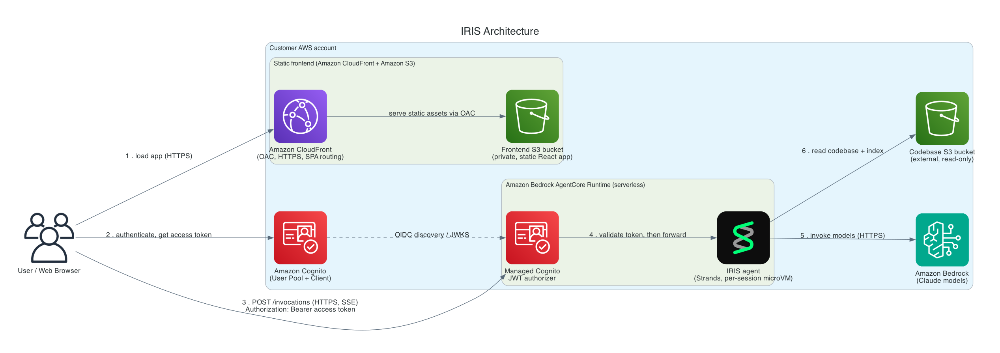

<!-- Copyright Amazon.com, Inc. or its affiliates. All Rights Reserved. -->
<!-- SPDX-License-Identifier: MIT-0 -->

# Deployment Guide

This comprehensive guide covers all deployment options for IRIS, from local development to production cloud deployment. Choose the deployment method that best fits your needs.

## Table of Contents

- [Quick Start](#quick-start)
- [Deployment Options Overview](#deployment-options-overview)
- [Local Development Deployment](#local-development-deployment)
- [Docker Deployment](#docker-deployment)
- [Cloud Deployment (AWS)](#cloud-deployment-aws)
- [Configuration](#configuration)
- [Security Considerations](#security-considerations)
- [Troubleshooting](#troubleshooting)

## Quick Start

The fastest way to get started is using the interactive deployment script.

```bash
# From the repository root
./deploy.sh
```

This script provides 5 deployment options with guided setup for each.

## Deployment Options Overview

| Option                             | Use Case                  | Complexity | Requirements             | Recommendation                                       |
| ---------------------------------- | ------------------------- | ---------- | ------------------------ | ---------------------------------------------------- |
| **Local (No Docker)**              | Development, Testing      | Low        | Python, Node.js, AWS CLI | **Start here if new**                                |
| **Local Docker (Local Artifacts)** | Integration Testing       | Medium     | Docker, Docker Compose   | Testing frontend and backend servers in isolation    |
| **Local Docker (S3 Artifacts)**    | Cloud Integration Testing | Medium     | Docker, S3 Bucket        | Cloud integration testing                            |
| **Cloud Deployment (AgentCore)**   | Production                | High       | AWS Account, CDK, S3     | Serverless end-to-end cloud deployment for prod env  |

## Interactive Deployment Script

The `deploy.sh` script provides an interactive menu with comprehensive setup for each deployment option.

### Features

- **Automatic prerequisite checking** (AWS CLI, Docker, Python, Node.js, jq)
- **AWS credentials validation** and setup
- **S3 bucket management** (creation and configuration)
- **App name configuration**
- **Codebase artifacts generation** and upload
- **Cross-platform support** (Linux/macOS/Windows with Git Bash)

### Usage

```bash
./deploy.sh
```

**Menu Options:**

1. **Local Testing (No Docker)** - Development mode with separate backend/frontend _(Recommended for new users)_
2. **Local Testing (Docker - Local Artifacts)** - Containerized testing with local data
3. **Local Testing (Docker - S3 Artifacts)** - Containerized testing with cloud data
4. **Cloud Deployment (AgentCore Runtime - serverless)** - Full AWS deployment wizard
5. **MCP Server Deployment** - Configure MCP server for Cline, Kiro, and Amazon Q
6. **Exit**

> **📖 For Cloud Deployment:** After deployment completes, see the [User Management Guide](user-management.md) for detailed instructions on creating and sharing user accounts.

### Prerequisites Check

The script automatically verifies:

- AWS CLI installation and configuration
- Docker and Docker Compose availability
- Python 3.10+ installation
- Node.js and npm availability
- jq for JSON processing

## Local Development Deployment (Manual)

> **💡 For ease of use, we recommend using `./deploy.sh` instead.** The content below is for manual deployment when you need full control over each step.

### Option 1: Automated Setup (Recommended)

Use the interactive deployment script for guided setup:

```bash
./deploy.sh
# Select option 1: "Local Testing (No Docker)"
```

The script will automatically:

- Check prerequisites
- Configure directories
- Generate codebase summary
- Start backend and frontend servers

### Option 2: Manual Setup (Advanced Users)

For manual control over each step:

#### Without Docker (Fastest for Development)

> **💡 New to IRIS?** We recommend starting here for the quickest setup and easiest development experience.

#### Prerequisites

- Python 3.10+
- uv (recommended) or pip
- AWS CLI configured
- Node.js and npm

#### Setup Steps

1. **Install Dependencies**:

   ```bash
   # Using uv (recommended)
   uv sync

   # Or using pip
   python -m venv venv
   source venv/bin/activate  # On macOS/Linux
   pip install -e .
   ```

2. **Configure Application**:
   Edit `config.yaml`:

   ```yaml
   codebase_dir: /path/to/your/codebase
   output_dir: .iris_cache

   model_configuration:
     file_summarizer:
       models:
         - model_id: us.anthropic.claude-haiku-4-5-20251001-v1:0
           region: us-east-1
     response_generator:
       model_id: us.anthropic.claude-haiku-4-5-20251001-v1:0
       region: us-west-2
   ```

3. **Set AWS Credentials**:

   ```bash
   export AWS_PROFILE=your-profile
   # OR
   export AWS_ACCESS_KEY_ID=your-key
   export AWS_SECRET_ACCESS_KEY=your-secret
   ```

4. **Generate Codebase Summary**:

   ```bash
   cd backend/
   uv run python scripts/generate_summary.py --local
   cd ..
   ```

5. **Start Backend Server**:

   ```bash
   cd backend/
   # Allow unauthenticated local access (no Cognito) and enable CORS for the dev server
   export ALLOW_ANONYMOUS=true
   export CORS_ORIGINS="http://localhost:3000,http://127.0.0.1:3000"
   uv run python agent_runtime.py
   ```

   This starts the AgentCore Runtime entrypoint on port 8080 (`POST /invocations` + `GET /ping`).

6. **Start Frontend Server** (in new terminal):

   ```bash
   cd frontend/
   npm install
   npm start
   ```

7. **Access Application**: Navigate to `http://localhost:3000/`

#### Development Features

- **Hot Reloading**: Both backend and frontend support hot reloading
- **Debug Mode**: Easy debugging with direct Python execution
- **Fast Iteration**: Immediate feedback on code changes
- **CLI Access**: Full CLI functionality available

## Docker Deployment

### Prerequisites

- Docker and Docker Compose
- AWS CLI configured
- jq (for credential handling)

### Option 1: Local Artifacts

Test the full containerized environment with local codebase data.

#### Setup Steps

1. **Generate Docker Configuration**:

   ```bash
   cd backend/
   uv run python scripts/create_docker_config.py
   cd ..
   ```

2. **Generate Local Artifacts**:

   ```bash
   cd backend/
   uv run python scripts/generate_summary.py --local
   cd ..
   ```

3. **Start Docker Environment**:

   ```bash
   ./scripts/start-docker.sh --force-build
   ```

4. **Access Application**: Navigate to `http://localhost:3000`

#### Docker Architecture

- **AgentCore Backend**: AgentCore Runtime entrypoint (`agent_runtime.py`) on port 8080 (`POST /invocations` + `GET /ping`)
- **React Frontend**: React application on port 3000
- **Session Management**: Per-session in-memory agent (the browser sends a session id header)
- **Agent Streaming**: Real-time response streaming over Server-Sent Events

### Option 2: S3 Artifacts

Test with cloud-stored artifacts (requires S3 bucket).

#### Setup Steps

1. **Create S3 Bucket**:

   ```bash
   aws s3 mb s3://your-test-bucket --region us-east-1

   # Enable Block Public Access
   aws s3api put-public-access-block \
     --bucket your-test-bucket \
     --public-access-block-configuration \
       BlockPublicAcls=true,IgnorePublicAcls=true,BlockPublicPolicy=true,RestrictPublicBuckets=true

   # Enable versioning
   aws s3api put-bucket-versioning \
     --bucket your-test-bucket \
     --versioning-configuration Status=Enabled
   ```

2. **Generate and Upload Artifacts**:

   ```bash
   # Option A: Direct upload
   uv run python scripts/generate_summary.py --s3-bucket your-test-bucket --s3-prefix test-prefix

   # Option B: Local generation + upload
   uv run python scripts/generate_summary.py --local
   uv run python scripts/upload_to_s3.py --s3-bucket your-test-bucket --s3-prefix test-prefix --codebase-artifacts-dir ../codebase_artifacts
   ```

3. **Start Docker with S3**:
   ```bash
   ./scripts/start-docker-s3.sh --s3-bucket your-test-bucket --s3-prefix test-prefix --force-build
   ```

### Docker Configuration

The `start-docker.sh` script securely handles AWS credentials:

- **Temporary Credentials**: Fetches temporary credentials from AWS profile
- **SSO Support**: Converts SSO credentials to access keys
- **Security**: Never stores credentials in Docker files
- **Multi-Auth**: Supports profiles, environment variables, SSO

### Docker Commands

```bash
# View logs
docker-compose logs agentcore-backend
docker-compose logs react-frontend

# Restart services
docker-compose restart agentcore-backend

# Stop services
docker-compose down

# Rebuild with cache clearing
./scripts/start-docker.sh --force-build
```

## Cloud Deployment (AWS)

### Prerequisites

- AWS Account with appropriate permissions
- AWS CLI configured
- AWS CDK CLI: `npm install -g aws-cdk`
- S3 bucket for artifacts storage

### Deployment Architecture



**Components:**

- **Amazon Bedrock AgentCore Runtime**: Serverless backend hosting the IRIS agent (invoked directly by the browser over HTTPS)
- **Amazon CloudFront**: CDN and HTTPS delivery for the static frontend (private S3 origin via OAC)
- **Amazon S3**: Private frontend bucket, access-log buckets, and the external codebase artifacts bucket
- **Amazon Cognito**: User authentication; its JWT authorizer gates the Runtime
- **AWS CDK (Python)**: Infrastructure as Code

### Manual Cloud Deployment

#### 1. Create S3 Bucket

```bash
aws s3 mb s3://your-production-bucket --region us-east-1

# Enable Block Public Access (all 4 settings)
aws s3api put-public-access-block \
  --bucket your-production-bucket \
  --public-access-block-configuration \
    BlockPublicAcls=true,IgnorePublicAcls=true,BlockPublicPolicy=true,RestrictPublicBuckets=true

# Enable versioning
aws s3api put-bucket-versioning \
  --bucket your-production-bucket \
  --versioning-configuration Status=Enabled

# Enforce TLS/HTTPS via bucket policy
aws s3api put-bucket-policy --bucket your-production-bucket --policy '{
  "Version": "2012-10-17",
  "Statement": [{
    "Sid": "EnforceTLS",
    "Effect": "Deny",
    "Principal": "*",
    "Action": "s3:*",
    "Resource": ["arn:aws:s3:::your-production-bucket", "arn:aws:s3:::your-production-bucket/*"],
    "Condition": {"Bool": {"aws:SecureTransport": "false"}}
  }]
}'

# Enable encryption with customer managed AWS KMS key (recommended for production)
aws s3api put-bucket-encryption \
  --bucket your-production-bucket \
  --server-side-encryption-configuration '{
    "Rules": [{
      "ApplyServerSideEncryptionByDefault": {
        "SSEAlgorithm": "aws:kms",
        "KMSMasterKeyID": "arn:aws:kms:us-east-1:ACCOUNT_ID:key/KEY_ID"
      },
      "BucketKeyEnabled": true
    }]
  }'

# Enable access logging
aws s3api put-bucket-logging \
  --bucket your-production-bucket \
  --bucket-logging-status '{
    "LoggingEnabled": {
      "TargetBucket": "your-logging-bucket",
      "TargetPrefix": "s3-access-logs/"
    }
  }'
```

> **Note:** For production deployments, also consider enabling MFA Delete on the bucket. See [Encryption at Rest](encryption-at-rest.md) for AWS KMS key setup details.

#### 2. Generate and Upload Artifacts

```bash
# Generate Docker configuration
cd backend/
uv run python scripts/create_docker_config.py
cd ..

# Upload codebase artifacts
uv run python scripts/generate_summary.py --s3-bucket your-production-bucket --s3-prefix production
```

#### 3. Configure Infrastructure

Edit `infra/config.yaml`:

```yaml
# CDK stack name
app_name: IrisProduction

# S3 configuration
codebase_artifacts:
  bucket: "your-production-bucket"
  prefix: "production"
  # S3 Security Requirements (apply via AWS CLI or CDK):
  # - Block Public Access: Enabled (all 4 settings)
  # - Encryption: SSE-KMS with customer managed AWS KMS key
  # - Versioning: Enabled
  # - TLS/HTTPS: Enforced via bucket policy
  # - Access Logging: Enabled to audit bucket
  # - MFA Delete: Recommended for production
  kms_key_arn: "" # Optional: Customer managed AWS KMS key ARN for S3 encryption
# Optional: Amazon Bedrock Guardrail id (grants bedrock:ApplyGuardrail when set)
# guardrail_id: ""
```

#### 4. Customize Application

Edit `frontend/runtime-config-cloud.js`:

```javascript
window.RUNTIME_CONFIG = {
  appName: "Your Company IRIS",
  // Add other customizations
};
```

#### 5. Deploy Infrastructure

```bash
# Activate virtual environment
source .venv/bin/activate

# Deploy CDK stack (builds the ARM64 AgentCore container image and provisions
# the Runtime, Cognito user pool, and the S3/CloudFront static frontend)
cd infra/
cdk deploy --context region=us-east-1
```

> **Note:** The AgentCore Runtime requires an ARM64 image, which the CDK asset builds automatically via buildx. This build can take several minutes.

#### 6. Build and Upload the Frontend

The stack provisions the frontend bucket and Amazon CloudFront distribution but does not deploy the app itself, so the AgentRuntimeArn can be injected after the stack exists. Read the stack outputs, build the React app with `runtime-config.js` injected, and upload it to the frontend bucket:

```bash
# Read the values you need from the stack outputs (CloudFormation → Outputs):
#   AgentRuntimeArn, FrontendBucketName, CognitoUserPoolId, CognitoUserPoolClientId

cd frontend/
npm ci
npm run build

# Inject Cognito + AgentRuntimeArn into the built app, then upload
cp runtime-config-cloud.js dist/runtime-config.js
AWS_REGION=us-east-1 \
  USER_POOL_ID=<CognitoUserPoolId> \
  USER_POOL_CLIENT_ID=<CognitoUserPoolClientId> \
  AGENT_RUNTIME_ARN=<AgentRuntimeArn> \
  CONFIG_FILE="./dist/runtime-config.js" \
  ./inject-config.sh

aws s3 sync dist/ s3://<FrontendBucketName>/ --delete --region us-east-1
```

> **Tip:** The `deploy.sh` wizard (option 4) automates this step, including a CloudFront cache invalidation so the new build is served immediately.

#### 7. Create User Accounts

After deployment, create user accounts in Cognito. See the [User Management Guide](user-management.md) for detailed instructions on creating users with either email-based or username-based sign-in.

#### 8. Get Application URL

1. Go to CloudFormation console
2. Find your deployed stack
3. Click "Outputs" tab
4. Copy the `CloudFrontURL` value

### Automated Cloud Deployment

Use the interactive script for guided deployment:

```bash
./deploy.sh
# Select option 4: "Cloud Deployment (AgentCore Runtime - serverless)"
```

The wizard will guide you through:

1. Directory configuration
2. S3 bucket configuration (codebase artifacts)
3. AWS region selection
4. Artifact generation and upload to S3
5. CDK infrastructure deployment (AgentCore Runtime + static frontend)
6. Frontend build and upload (with the AgentRuntimeArn injected)
7. Post-deployment user creation instructions

## Configuration

### Infrastructure Configuration

Edit `infra/config.yaml` to configure your deployment:

```yaml
# CDK stack name
app_name: "IrisProduction"

# S3 configuration for codebase artifacts
codebase_artifacts:
  bucket: "your-production-bucket"
  prefix: "production"
  kms_key_arn: "" # Optional: Customer managed AWS KMS key ARN
# Optional: Amazon Bedrock Guardrail id
# guardrail_id: ""
```

### Application Customization

Edit `frontend/runtime-config-cloud.js` to customize the application name:

```javascript
window.RUNTIME_CONFIG = {
  appName: "Your Company IRIS",
  // Other settings are automatically configured
};
```

## Security Considerations

### Infrastructure Security

#### Main Configuration (`config.yaml`)

```yaml
# Codebase settings
codebase_dir: /path/to/codebase
output_dir: .iris_cache

# Model configurations
model_configuration:
  file_summarizer:
    models:
      - model_id: us.anthropic.claude-haiku-4-5-20251001-v1:0
        region: us-east-1
      - model_id: us.anthropic.claude-haiku-4-5-20251001-v1:0
        region: us-east-2
  response_generator:
    model_id: us.anthropic.claude-haiku-4-5-20251001-v1:0
    region: us-west-2
# Context settings
context_window_size: 200000
context_file: /path/to/additional/context.txt

# File processing
ignore_patterns:
  - "build/"
  - "_build/"
  - "_templates/"
  - "node_modules/"
  - ".git/"
  - "__pycache__/"
```

#### Infrastructure Configuration (`infra/config.yaml`)

```yaml
# CDK stack name
app_name: "IrisProduction"

# S3 bucket configuration for codebase artifacts
# (external/pre-existing bucket read by the Runtime in S3 mode;
#  leave the bucket empty to bake the codebase into the image instead)
codebase_artifacts:
  bucket: "your-production-bucket"
  prefix: "production"
  # Optional: Customer managed AWS KMS key ARN for reading encrypted artifacts
  kms_key_arn: ""

# Optional: Amazon Bedrock Guardrail id (grants bedrock:ApplyGuardrail when set)
# guardrail_id: ""
```

#### Frontend Configuration

The frontend is configured via `window.RUNTIME_CONFIG`, which supplies the AWS region, Amazon Cognito user pool id, Amazon Cognito app client id, and the AgentRuntimeArn. For local development, Vite environment variables provide the same values (including `VITE_LOCAL_AGENT_URL`, which points the browser at the local `agent_runtime.py` on port 8080).

**Development** (`frontend/.env.development`):

```env
VITE_APP_NAME="IRIS Dev"
VITE_LOCAL_AGENT_URL=http://localhost:8080
VITE_AUTH_ENABLED=false
```

**Docker** (`frontend/runtime-config-dev.js`):

```javascript
window.RUNTIME_CONFIG = {
  appName: "IRIS Docker",
  localAgentUrl: "http://localhost:8080",
  authMethod: "none",
};
```

**Cloud** (`frontend/runtime-config-cloud.js`):

```javascript
window.RUNTIME_CONFIG = {
  appName: "Your Company IRIS",
  // awsRegion, userPoolId, userPoolClientId, and agentRuntimeArn are injected
  // at deploy time by inject-config.sh from the CDK stack outputs.
};
```

### Environment-Specific Configurations

#### Development Environment

- **Fast iteration**: Hot reloading enabled
- **Debug logging**: Verbose logging for troubleshooting
- **Local storage**: Files stored locally
- **Direct access**: No authentication required

#### Testing Environment

- **Docker containers**: Consistent environment
- **S3 integration**: Test cloud storage
- **Authentication**: Optional Cognito testing
- **Performance testing**: Load testing capabilities

#### Production Environment

- **High availability**: Serverless AgentCore Runtime managed by AWS
- **Security**: Full authentication and authorization
- **Monitoring**: CloudWatch integration
- **Backup**: Automated backups

## Security Considerations

### AI Services Opt-Out Policy

IRIS uses Amazon Bedrock to process your code artifacts. Amazon Bedrock may use customer content for service improvements unless you opt out.

**To prevent Amazon Bedrock from using your content for service improvements:**

1. Enable the AI Services Opt-Out policy in your AWS Organizations account
2. Follow the instructions at: https://docs.aws.amazon.com/organizations/latest/userguide/orgs_manage_policies_ai-opt-out.html

**Important Notes:**

- IRIS uses your AWS account credentials to call Amazon Bedrock directly
- Your content is processed using your IAM roles and permissions
- Amazon Bedrock automatically honors your AI Opt-Out policy when enabled
- This is your responsibility as the AWS account owner

For more information about AWS AI Services and data usage, see the [AWS Service Terms](https://aws.amazon.com/service-terms/) Section 50.3.

### Infrastructure Security

1. **Network Security**:
   - **Managed Runtime Boundary**: Serverless AgentCore Runtime in `PUBLIC` network mode — no customer VPC, subnets, NAT gateways, load balancers, or security groups to manage
   - **Authorizer-Gated Access**: The Runtime's built-in Amazon Cognito JWT authorizer validates tokens before requests reach the container
   - **Private Frontend Origin**: The S3 frontend bucket is private and reachable only through Amazon CloudFront via OAC
   - **HTTPS Enforcement**: All traffic encrypted in transit

2. **Authentication & Authorization**:
   - **Amazon Cognito Integration**: Centralized user management
   - **JWT Authorization**: The frontend sends the Cognito access token as a Bearer token on every AgentCore invocation
   - **Session Management**: Per-session microVM isolation

3. **Data Security**:
   - **S3 Block Public Access**: All four settings enabled on all buckets
   - **S3 Encryption**: Server-side encryption enabled (SSE-KMS with customer managed AWS KMS key for production)
   - **S3 Versioning**: Enabled for all artifact buckets
   - **S3 MFA Delete**: Recommended for production buckets containing sensitive data
   - **S3 TLS/HTTPS Enforcement**: Bucket policies deny non-SSL requests (`enforce_ssl=True`)
   - **S3 Access Logging**: Enabled for audit trails and compliance
   - **Transit Encryption**: TLS for all communications
   - **IAM Roles**: Least privilege access to S3 resources

### Application Security

1. **Input Validation**:
   - **Query Sanitization**: Clean user inputs
   - **File Path Validation**: Prevent directory traversal
   - **Content Filtering**: Remove sensitive information

2. **API Security**:
   - **Rate Limiting**: Prevent abuse
   - **Request Validation**: Validate all API requests
   - **Error Handling**: Secure error messages

3. **Credential Management**:
   - **AWS IAM Roles**: No hardcoded credentials
   - **Environment Variables**: Secure credential storage
   - **Rotation**: Regular credential rotation

### Security Best Practices

1. **Regular Updates**:
   - Keep dependencies updated
   - Apply security patches promptly
   - Monitor for vulnerabilities

2. **Monitoring**:
   - Enable CloudTrail logging
   - Set up CloudWatch alarms
   - Monitor for unusual activity

3. **Access Control**:
   - Use IAM roles with minimal permissions
   - Implement network segmentation
   - Regular access reviews

## Monitoring and Maintenance

### Application Monitoring

#### CloudWatch Integration

The AgentCore Runtime emits its own service metrics and logs to CloudWatch. The IRIS
stack does not define custom metrics, alarms, or dashboards — if you want alerting
(for example on error rate or latency), create CloudWatch alarms against the Runtime's
metrics or a metric filter on the log group below.

#### Application Logs

```bash
# View AgentCore Runtime logs (log group prefix: /aws/bedrock-agentcore/runtimes/)
aws logs tail /aws/bedrock-agentcore/runtimes --follow

# Search for errors
aws logs filter-log-events --log-group-name-prefix /aws/bedrock-agentcore/runtimes --filter-pattern "ERROR"
```

### Performance Monitoring

#### Key Metrics

1. **Response Times**:
   - Average response time
   - 95th percentile response time
   - Timeout rates

2. **Resource Usage**:
   - CPU utilization
   - Memory usage
   - Network I/O
   - Storage usage

3. **Business Metrics**:
   - Active users
   - Query volume
   - Feature usage
   - Error rates

#### Optimization Strategies

1. **Caching**:
   - Implement response caching
   - Cache file summaries
   - Use CDN for static assets

2. **Scaling**:
   - Serverless scaling handled by the AgentCore Runtime
   - Distribute model calls across regions

3. **Performance Tuning**:
   - Optimize model selection
   - Batch processing

### Maintenance Tasks

#### Regular Maintenance

1. **Weekly Tasks**:
   - Review error logs
   - Check performance metrics
   - Update dependencies
   - Backup verification

2. **Monthly Tasks**:
   - Security updates
   - Capacity planning
   - User access review

3. **Quarterly Tasks**:
   - Security audit
   - Performance benchmarking
   - Architecture review

#### Backup and Recovery

1. **Data Backup**:

   ```bash
   # Backup S3 artifacts
   aws s3 sync s3://source-bucket s3://backup-bucket --delete

   # Backup configuration
   aws s3 cp infra/config.yaml s3://backup-bucket/config/
   ```

2. **Infrastructure Backup**:

   ```bash
   # Export CloudFormation template
   aws cloudformation get-template --stack-name Iris > backup-template.json

   # Backup CDK code
   git archive --format=tar.gz --output=cdk-backup.tar.gz HEAD
   ```

3. **Recovery Procedures**:
   - Document recovery steps
   - Test recovery procedures
   - Maintain recovery runbooks

## Troubleshooting

### Common Deployment Issues

#### 1. AWS Credential Problems

**Symptoms**:

- "Unable to locate credentials" errors
- "Access denied" errors
- Authentication failures

**Solutions**:

```bash
# Verify credentials
aws sts get-caller-identity

# Check profile configuration
aws configure list

# Test Amazon Bedrock access
aws bedrock list-foundation-models --region us-west-2

# Refresh SSO credentials
aws sso login --profile your-profile
```

#### 2. Docker Build Failures

**Symptoms**:

- Build timeouts
- Dependency installation failures
- Image size issues

**Solutions**:

```bash
# Clear Docker cache
docker system prune -a

# Force rebuild
./scripts/start-docker.sh --force-build

# Check Docker resources
docker system df

# Increase Docker memory/CPU limits
```

#### 3. CDK Deployment Failures

**Symptoms**:

- Stack creation failures
- Resource limit errors
- Permission denied errors

**Solutions**:

```bash
# Check CDK version
cdk --version

# Bootstrap CDK (if first time)
cdk bootstrap aws://ACCOUNT-NUMBER/REGION

# Check CloudFormation events
aws cloudformation describe-stack-events --stack-name Iris

# Verify IAM permissions
aws iam simulate-principal-policy --policy-source-arn arn:aws:iam::ACCOUNT:user/USERNAME --action-names cloudformation:CreateStack
```

#### 4. S3 Access Issues

**Symptoms**:

- "Access denied" when uploading artifacts
- Bucket not found errors
- Permission errors

**Solutions**:

```bash
# Verify bucket exists
aws s3 ls s3://your-bucket

# Check bucket permissions
aws s3api get-bucket-policy --bucket your-bucket

# Test upload permissions
aws s3 cp test-file.txt s3://your-bucket/test/

# Check bucket region
aws s3api get-bucket-location --bucket your-bucket
```

### Runtime Issues

#### 1. High Response Times

**Diagnosis**:

```bash
# Check AgentCore Runtime logs
aws logs tail /aws/bedrock-agentcore/runtimes --follow
```

**Solutions**:

- Optimize model selection
- Implement caching
- Review query complexity

#### 2. Memory Issues

**Diagnosis**:

```bash
# Check AgentCore Runtime logs for errors
aws logs filter-log-events --log-group-name-prefix /aws/bedrock-agentcore/runtimes --filter-pattern "ERROR"
```

**Solutions**:

- Implement conversation cleanup
- Optimize file processing
- Review agent memory usage

#### 3. Authentication Issues

**Diagnosis**:

```bash
# Check Cognito user pool
aws cognito-idp list-users --user-pool-id your-pool-id

# Check user status
aws cognito-idp admin-get-user --user-pool-id your-pool-id --username username
```

**Solutions**:

- Verify email verification status
- Reset user password
- Review Cognito configuration

### Performance Optimization

#### 1. Model Optimization

```yaml
# Use faster models for development
model_configuration:
  file_summarizer:
    models:
      - model_id: us.anthropic.claude-haiku-4-5-20251001-v1:0 # Faster
        region: us-east-1
  response_generator:
    model_id: us.anthropic.claude-haiku-4-5-20251001-v1:0 # Faster
    region: us-west-2
```

#### 2. Caching Configuration

```yaml
# Enable caching
caching:
  enabled: true
  ttl: 3600 # 1 hour
  max_size: 1000 # Maximum cached items
```

#### 3. Parallel Processing

```yaml
# Use multiple regions for parallel processing
model_configuration:
  file_summarizer:
    models:
      - model_id: us.anthropic.claude-haiku-4-5-20251001-v1:0
        region: us-east-1
      - model_id: us.anthropic.claude-haiku-4-5-20251001-v1:0
        region: us-west-2
      - model_id: us.anthropic.claude-haiku-4-5-20251001-v1:0
        region: eu-west-1
```

### Stack Management

#### Updating Deployments

```bash
# Update application code (rebuilds the AgentCore container image and redeploys the Runtime)
git pull origin main
cd infra/
cdk deploy --context region=us-east-1

# After a redeploy, rebuild and re-upload the frontend (see "Build and Upload the Frontend"),
# or simply re-run ./deploy.sh option 4 to handle both steps.
```

#### Destroying Deployments

**Method 1: CDK CLI**

```bash
cd infra/
cdk destroy --context region=us-east-1
```

**Method 2: CloudFormation Console**

1. Navigate to CloudFormation Console
2. Select your stack
3. Click "Delete" and confirm
4. Wait for deletion to complete

**Important Notes**:

- The stack-created S3 buckets (frontend and access-log buckets) are emptied and removed on stack deletion by the auto-delete custom resource
- The external codebase artifacts bucket is NOT deleted by the stack — clean it up manually if needed
- Verify all resources are deleted to avoid charges

#### Manual Cleanup

```bash
# Delete S3 bucket contents
aws s3 rm s3://your-bucket --recursive

# Delete S3 bucket
aws s3 rb s3://your-bucket

# Check for remaining resources
aws resourcegroupstaggingapi get-resources --tag-filters Key=Project,Values=Iris
```

## Related Documentation

- [User Management Guide](user-management.md) - User account creation and management
- [Development Guide](dev-guide.md) - Development setup and workflows
- [Agentic Architecture](agentic-architecture.md) - Detailed architecture overview
- [MCP Integration](mcp.md) - Model Context Protocol integration
- [Architecture Overview](architecture.md) - High-level system architecture
